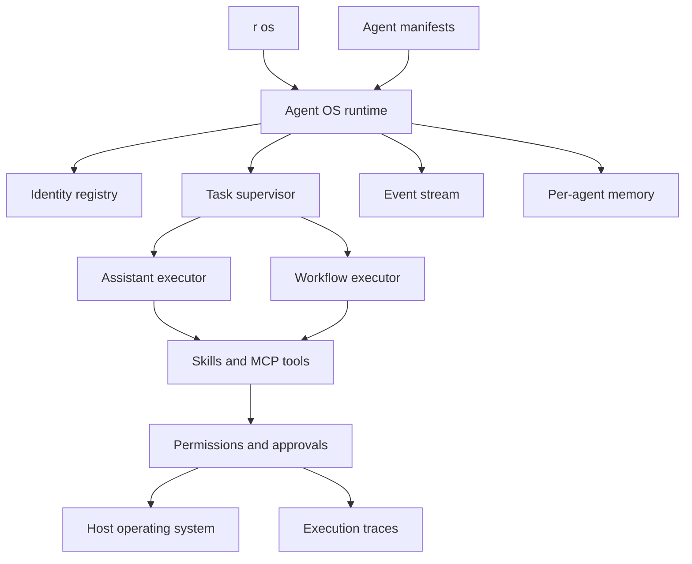

# R Agent OS

R Agent OS is an application-level operating layer for local AI agents. It does not replace
Linux, macOS, or Windows. It provides the primitives agents need to run as governed,
persistent processes on top of the host operating system.

## Current Kernel

- **Identity:** YAML manifests define an agent's name, prompt, capabilities, and executor.
- **Processes:** Tasks move through `queued`, `paused`, `running`, `completed`, `failed`,
  and `cancelled`.
- **Persistence:** SQLite stores identities, task history, and events.
- **Memory:** Every agent receives an isolated session namespace, with optional GBrain
  backing for continuous recall across sessions.
- **Capabilities:** Skills are explicitly assigned to assistant agents.
- **Execution:** Agents can use an LLM or deterministic R workflows.
- **Security:** Existing permission policy, approvals, redaction, and audit traces remain active.
- **Privacy:** LLM inference is restricted to loopback endpoints under local-only mode.
- **Isolation:** Agents declare network allowlists and filesystem roots.
- **Operator console:** the local Control Center at `/ui` exposes runtime, memory, security,
  capability, and agent summaries for humans supervising the system.
- **Observability:** Tasks emit lifecycle events, tool calls appear in `r traces`, and
  task capsules export a redacted local flight recorder for one execution.

## Architecture



## Commands

```bash
r os init researcher.yaml
r os agent install researcher.yaml
r os agent list
r os agent show researcher
r os submit researcher "Analyze this project" --priority high
r os reprioritize <task-id> critical
r os worker --max-tasks 10
r os start <task-id>
r os run researcher "Analyze this project"
r os tasks --status completed
r os pause <task-id>
r os resume <task-id>
r os cancel <task-id>
r os capsule <task-id> --output task-capsule.json
r os events
r os status
r os security
```

Tasks can be paused while they are still queued. A paused task will not be moved to
`running` until it is resumed, which gives operators a simple approval checkpoint before
background workers pick up queued work. Running tasks cannot be paused yet; cancel them
instead.

## Control Center

When the local API is running, Agent OS is also available through a web Control Center:

```bash
r serve --port 8765
```

Then open `http://127.0.0.1:8765/ui`.

The Control Center is intended as the operator-facing shell for R. It surfaces:

- queue and runtime status;
- installed agents and task counts;
- capability domains across the available skill set;
- memory backend state, including GBrain integration;
- security posture and network restrictions.

`r os submit` makes the queue explicit: tasks can be enqueued first, reviewed in the
process table, paused or resumed, reprioritized as urgency changes, and then launched with
`r os start`. This is the first kernel-style separation between admission and execution.

Queue order is deterministic: `critical`, `high`, `normal`, and then `low`. Priority can
be changed while a task is still `queued` or `paused`, which gives operators a clean way
to escalate work without recreating jobs.

`r os worker` turns that queue into a long-lived execution loop. It can drain a bounded
batch with `--max-tasks`, process a single item with `--once`, or keep polling the queue
as a local daemon.

Task capsules are local audit bundles for a single execution:

```bash
r os capsule <task-id>
r os capsule <task-id> --json
r os capsule <task-id> --output task-capsule.json
r os capsule <task-id> --include-content --output private-debug.json
```

Capsules redact prompts, task input, results, errors, hosts, and filesystem paths by
default. They still include lifecycle events and capability counts, so users can diagnose
what happened without casually exposing private data.

## Workflow Agents

A deterministic agent points to an existing R workflow:

```yaml
name: nightly-report
description: Builds the local report from validated steps
kind: workflow
workflow: ./report.workflow.yaml
```

The submitted task is available to the workflow as `{{ vars.task }}`.

## Roadmap

The canonical project roadmap, phases, and exit criteria are maintained in
[ROADMAP.md](../ROADMAP.md).
