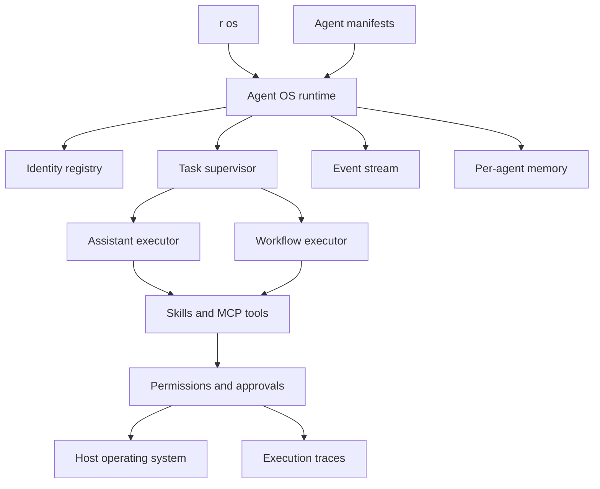

# R Agent OS

R Agent OS is an application-level operating layer for local AI agents. It does not replace
Linux, macOS, or Windows. It provides the primitives agents need to run as governed,
persistent processes on top of the host operating system.

## Current Kernel

- **Identity:** YAML manifests define an agent's name, prompt, capabilities, and executor.
- **Processes:** Tasks move through `queued`, `running`, `completed`, and `failed`.
- **Persistence:** SQLite stores identities, task history, and events.
- **Memory:** Every agent receives an isolated session namespace.
- **Capabilities:** Skills are explicitly assigned to assistant agents.
- **Execution:** Agents can use an LLM or deterministic R workflows.
- **Security:** Existing permission policy, approvals, redaction, and audit traces remain active.
- **Observability:** Tasks emit lifecycle events and tool calls appear in `r traces`.

## Architecture



## Commands

```bash
r os init researcher.yaml
r os agent install researcher.yaml
r os agent list
r os agent show researcher
r os run researcher "Analyze this project"
r os tasks --status completed
r os events
r os status
```

## Workflow Agents

A deterministic agent points to an existing R workflow:

```yaml
name: nightly-report
description: Builds the local report from validated steps
kind: workflow
workflow: ./report.workflow.yaml
```

The submitted task is available to the workflow as `{{ vars.task }}`.

## Roadmap

1. Background scheduler and resumable workers.
2. Message inboxes and agent-to-agent task delegation.
3. Resource budgets for time, tokens, tools, CPU, and memory.
4. Container and process sandbox providers.
5. Human approval queues and task cancellation.
6. Distributed workers across R nodes.
7. Visual process manager in the R OS shell.
